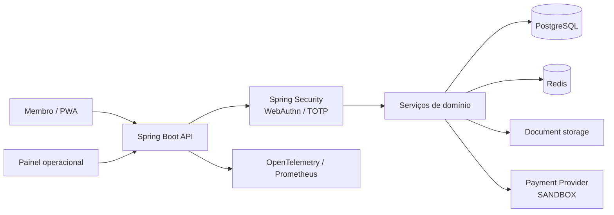
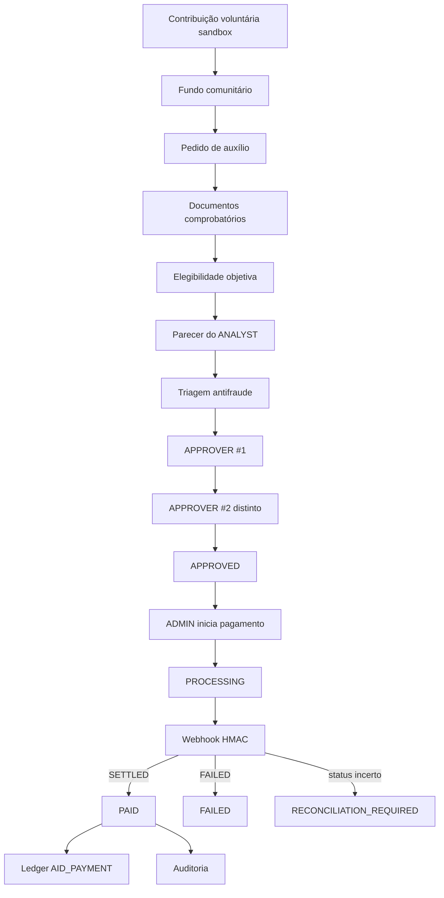
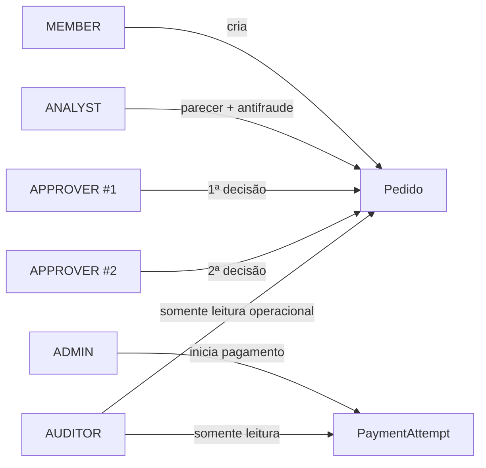
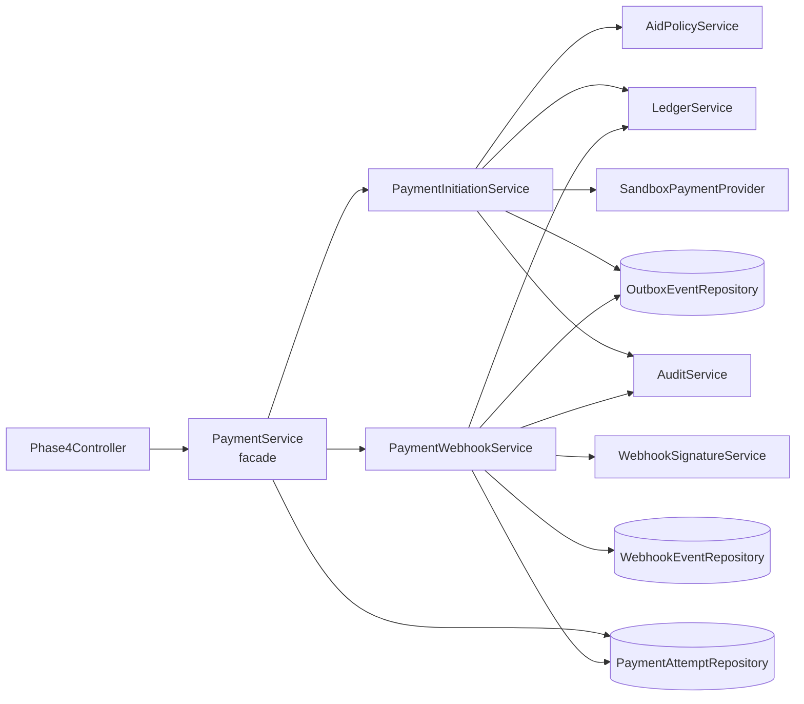
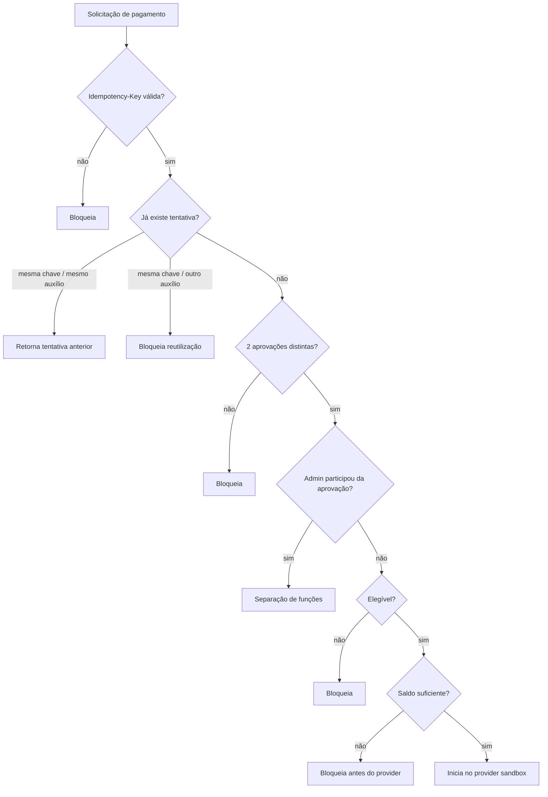
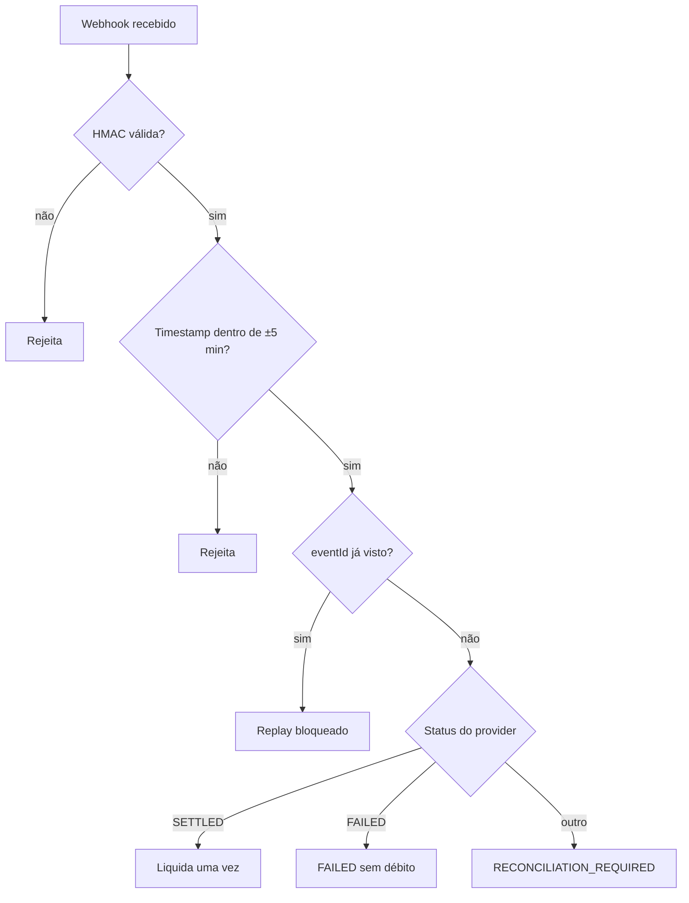
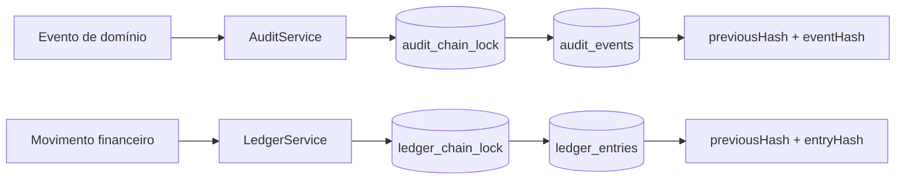
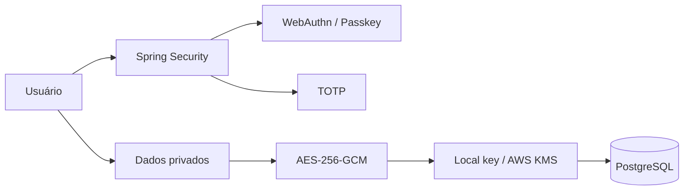
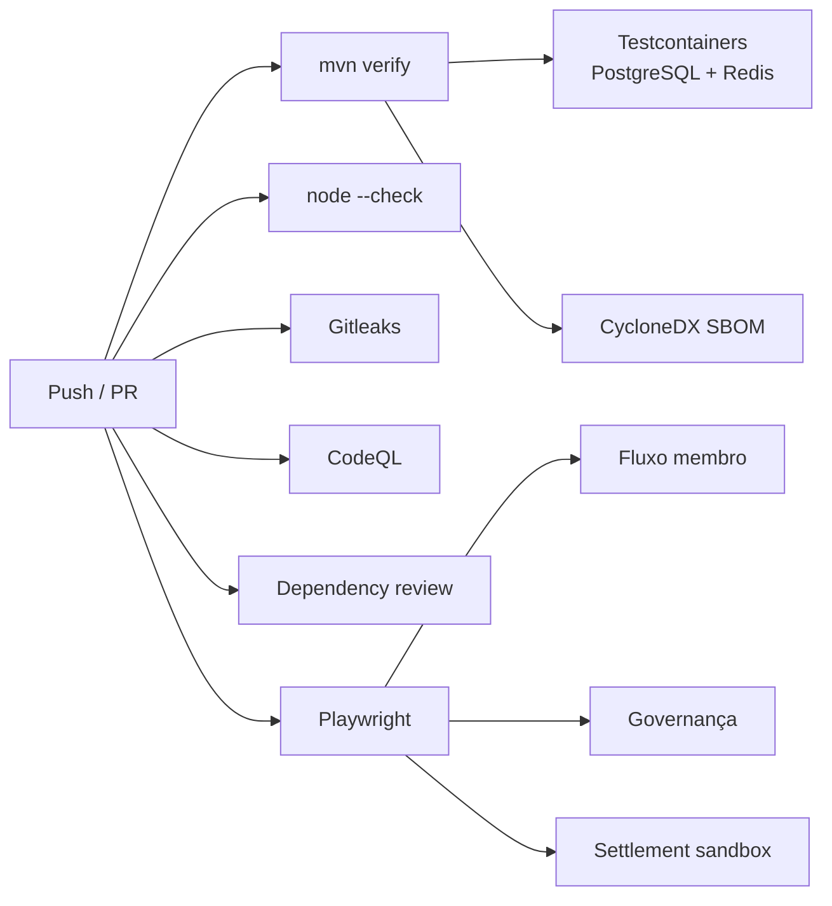

# Arquitetura — Fazer o Bem

Este documento resume a arquitetura atual da plataforma **Fazer o Bem**, com foco em fluxo de ajuda, segurança, governança, pagamentos sandbox, dados e auditabilidade.

> O projeto permanece sem dinheiro real. A camada de pagamento descrita aqui usa apenas provider sandbox.

## 1. Visão geral

A aplicação é um monólito modular Spring Boot. O frontend do membro e o painel operacional consomem a mesma API, enquanto as regras críticas ficam centralizadas no backend.

## 2. Fluxo completo de auxílio

O estado `PAID` não pode ser forçado pelo painel administrativo. A liquidação é consequência do webhook autenticado do provider sandbox.

## 3. Separação de responsabilidades por papel

Regras principais:

- analista não aprova;
- aprovador não pode aprovar duas vezes o mesmo pedido;
- os dois aprovadores precisam ser usuários distintos;
- quem aprovou o pedido não pode iniciar o pagamento;
- auditor não altera estado financeiro;
- admin inicia a tentativa, mas não liquida manualmente.

## 4. Arquitetura da camada de pagamento

A refatoração separa iniciação e processamento de webhook para reduzir o número de responsabilidades dentro de uma única classe e permitir testes menores e mais específicos.

## 5. Proteções do pagamento

### Webhook

A tabela `webhook_events` possui `eventId` único, reforçando a proteção contra replay também no banco.

## 6. Ledger e auditoria

As cadeias de auditoria e ledger usam SHA-256 e locks no banco para serializar a criação dos registros encadeados.

## 7. Dados sensíveis e identidade

Perfis privilegiados podem exigir MFA. Dados pessoais privados são protegidos antes de serem persistidos e a arquitetura prevê envelope encryption com AWS KMS.

## 8. Persistência

Principais grupos de dados:

| Grupo | Exemplos |
|---|---|
| Membros e identidade | `members`, `app_users`, KYC, consentimentos |
| Auxílio | `aid_requests`, documentos, análises, antifraude, aprovações |
| Pagamento | `payment_attempts`, `webhook_events`, `outbox_events` |
| Integridade | `ledger_entries`, `audit_events` |
| Privacidade | dados privados criptografados, DSAR |
| Recuperação | solicitações e aprovações administrativas |

As mudanças de schema são controladas pelo Flyway.

## 9. Testes e pipeline

O fluxo positivo e os caminhos negativos críticos são testados antes do merge.

## 10. Limites atuais

O sistema **não deve ser tratado como pronto para operação financeira real**. Antes de qualquer piloto com recursos reais ainda são necessários, entre outros:

- pentest independente;
- infraestrutura de produção e gestão real de segredos;
- domínio HTTPS e WebAuthn real;
- política LGPD formal e processos operacionais;
- revisão jurídica, contábil e regulatória;
- provider financeiro autorizado;
- reconciliação externa e monitoramento operacional;
- testes de desastre e restauração em ambiente semelhante a produção.

## 11. Decisão arquitetural principal

A regra central do projeto é que **nenhum ator isolado controla todo o ciclo do auxílio**. A arquitetura distribui criação, análise, aprovação, iniciação de pagamento e confirmação de settlement entre papéis e eventos diferentes, deixando evidências no ledger e na auditoria.
