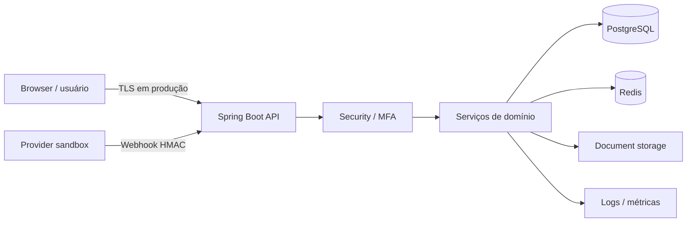

# Threat Model — Fazer o Bem

## Escopo

Este modelo cobre a arquitetura sandbox atual do Fazer o Bem: PWA do membro, painel operacional, API Spring Boot, autenticação/MFA, PostgreSQL, Redis, armazenamento de documentos, ledger, auditoria e provider de pagamento sandbox.

> O projeto não movimenta dinheiro real. Qualquer integração financeira real exige uma nova rodada de threat modeling, pentest e revisão regulatória.

## Objetivos de segurança

1. Nenhum auxílio pode ser pago sem elegibilidade, análise, antifraude e duas aprovações independentes.
2. Nenhum operador pode sozinho criar, aprovar e liquidar o mesmo auxílio.
3. Um evento de pagamento deve produzir no máximo um efeito financeiro no ledger.
4. Webhooks não autenticados, repetidos ou fora da janela temporal não podem alterar estado financeiro.
5. PII e documentos não podem aparecer em superfícies públicas ou respostas sem autorização.
6. Alterações relevantes precisam deixar evidência auditável e resistente a adulteração silenciosa.

## Ativos críticos

- PII dos membros e dados de KYC;
- documentos comprobatórios;
- credenciais, passkeys, segredos MFA e sessões;
- decisões de elegibilidade, análise, antifraude e aprovação;
- estado de `PaymentAttempt`;
- saldo e lançamentos do ledger;
- trilha de auditoria;
- chaves HMAC, chaves de criptografia e material de assinatura;
- backups e artefatos de recuperação.

## Atores

- `MEMBER`: cria contribuição sandbox, pedido e documentos próprios;
- `ANALYST`: registra parecer e triagem antifraude;
- `APPROVER`: decide sobre pedidos, sem poder aprovar duas vezes o mesmo caso;
- `ADMIN`: inicia pagamento e executa operações administrativas permitidas;
- `AUDITOR`: leitura operacional e de evidências;
- provider sandbox: fonte externa simulada de eventos de pagamento;
- atacante externo: sem credenciais legítimas;
- insider malicioso: usuário autenticado abusando das permissões concedidas;
- conta comprometida: identidade legítima controlada por terceiro.

## Trust boundaries

Fronteiras principais:

- navegador ↔ API;
- identidade autenticada ↔ autorização por papel;
- aplicação ↔ PostgreSQL/Redis/storage;
- provider ↔ endpoint de webhook;
- runtime ↔ secret manager/KMS em produção;
- aplicação ↔ observabilidade, que não deve receber PII desnecessária.

## Matriz de ameaças

| ID | Ameaça | Impacto | Controles atuais | Evidência / detecção | Risco residual |
|---|---|---|---|---|---|
| T01 | Conta ADMIN comprometida | Alto | MFA, separação de funções, ADMIN não aprova o pedido | audit trail, eventos de autenticação | Médio |
| T02 | APPROVER tenta votar duas vezes | Alto | unicidade por usuário/pedido e regra de domínio | histórico de aprovações | Baixo |
| T03 | Conluio de operadores | Alto | dois aprovadores distintos + papel separado de ADMIN | auditoria e IDs dos atores | Médio |
| T04 | Duas iniciações simultâneas | Alto | lock pessimista no auxílio, idempotência, índice único de tentativa ativa | payment attempts + auditoria | Baixo |
| T05 | Dois SETTLED concorrentes | Crítico | lock da tentativa, versão otimista, índice de settlement, ledger transacional | ledger + payment status | Baixo |
| T06 | Replay de webhook | Alto | `eventId` único persistido, HMAC e timestamp | webhook_events | Baixo |
| T07 | Corpo do webhook adulterado | Alto | HMAC sobre timestamp + body | rejeição e logs de segurança | Baixo |
| T08 | Webhook antigo/futuro | Alto | janela temporal exata de 5 minutos | rejeição de assinatura temporal | Baixo |
| T09 | Provider envia status desconhecido | Médio | `RECONCILIATION_REQUIRED`, sem débito | fila/histórico de reconciliação | Baixo |
| T10 | Documento malicioso | Alto | allowlist/tamanho, storage não público, hash | metadados e auditoria de acesso | Médio |
| T11 | IDOR em documento/PII | Alto | autorização por papel/dono e respostas redigidas | audit trail de acesso | Médio |
| T12 | Vazamento de PII em logs | Alto | separação de DTO público e dados privados | revisão de logs/pentest | Médio |
| T13 | Alteração direta do ledger | Crítico | encadeamento SHA-256, lock de cadeia, sem fluxo normal de DELETE | verificação de integridade | Médio |
| T14 | Alteração da auditoria | Alto | encadeamento por hash e lock de cadeia | verificação de integridade | Médio |
| T15 | Segredo versionado | Alto | Gitleaks/secret scan e variáveis de ambiente | CI bloqueia PR | Baixo |
| T16 | Roubo de sessão privilegiada | Alto | cookies/controles de sessão e MFA | eventos de auth; requer hardening de produção | Médio |
| T17 | Redis indisponível ou inconsistente | Médio | falha controlada e DB como fonte de verdade onde aplicável | health/metrics | Médio |
| T18 | Backup roubado | Crítico | requisito de criptografia/KMS antes de produção | processo operacional futuro | Alto antes de produção |
| T19 | Insider acessa PII sem necessidade | Alto | papel + propósito de acesso + auditoria | trilha de acesso | Médio |
| T20 | Fraude do membro | Alto | carência, teto, cooldown, documentos, antifraude | flags/analysis history | Médio |

## Abuse cases prioritários

### AC-01 — tentar pagar o mesmo auxílio duas vezes

Ataque: duas requisições de iniciação ou dois eventos `SETTLED` são enviados simultaneamente.

Controles: lock pessimista por auxílio/tentativa, idempotência, índice único de tentativa ativa, índice de settlement, `@Version`, transação e ledger serializado.

Resultado esperado: no máximo uma tentativa ativa e um único `AID_PAYMENT` efetivo.

### AC-02 — operador privilegiado tenta contornar governança

Ataque: um usuário tenta participar de várias etapas críticas.

Controles: ANALYST, APPROVER e ADMIN têm capacidades separadas; quem aprovou não pode iniciar o pagamento; duas aprovações precisam de usuários distintos.

Resultado esperado: operação bloqueada e tentativa observável em auditoria quando aplicável.

### AC-03 — forjar confirmação do provider

Ataque: enviar `SETTLED` diretamente ao endpoint.

Controles: HMAC-SHA256, timestamp, `eventId` único e lookup de `providerReference` persistida.

Resultado esperado: evento inválido não cria ledger nem altera `AidStatus`.

### AC-04 — explorar reconciliação para forçar PAID

Ataque: transformar estado incerto em pagamento sem evidência do provider.

Controle atual: estados incertos ficam em `RECONCILIATION_REQUIRED`; a UI não possui ação genérica de “marcar PAID”.

Risco residual: o processo operacional de reconciliação precisa de mais testes e, em produção, evidência externa independente.

## Controles de concorrência financeira

A camada financeira usa defesa em profundidade:

1. `Idempotency-Key` única;
2. lock pessimista no `AidRequest` antes da chamada ao provider;
3. rechecagem de idempotência após adquirir o lock;
4. flush das invariantes de banco antes do side effect do provider;
5. apenas uma tentativa ativa por auxílio via índice parcial;
6. `WebhookEvent.eventId` único e persistido antes da mutação financeira;
7. lock pessimista em `PaymentAttempt` no processamento do webhook;
8. `@Version` em `PaymentAttempt`;
9. somente um settlement por auxílio no banco;
10. ledger append-only serializado por lock de cadeia.

## Dados e privacidade

- PII é separada de endpoints de transparência;
- dados privados usam criptografia autenticada;
- KMS/envelope encryption é requisito para ambiente real;
- documentos ficam fora do diretório público;
- DTOs públicos não expõem `storageKey` nem hashes internos desnecessários;
- logs e traces devem evitar CPF, conteúdo de documentos, segredos e tokens.

## Evidências esperadas em incidente

Preservar, com controle de acesso:

- `audit_events` relacionados ao caso;
- `payment_attempts` e versões/tempos;
- `webhook_events` e hash do payload;
- `outbox_events`;
- lançamentos do ledger e cadeia de hashes;
- eventos de autenticação/MFA;
- logs de aplicação correlacionados por request/trace ID;
- evidência externa do provider quando existir integração real.

## Riscos aceitos nesta alpha

- provider e KYC continuam sandbox;
- não há pentest independente concluído;
- infraestrutura de produção, WAF/rate limiting externo e secret manager real não foram homologados;
- proteção e rotação de backups de produção ainda não foram validadas;
- fraude documental avançada não é resolvida apenas por validação de arquivo;
- conluio entre múltiplos usuários privilegiados permanece um risco de governança que exige controles organizacionais além do software.

## Gate antes de dinheiro real

Obrigatório reavaliar este documento e concluir, no mínimo:

- pentest independente e correção dos achados críticos/altos;
- arquitetura de rede/TLS/WAF/rate limiting;
- KMS/secret manager e rotação de chaves;
- backup criptografado + restore + disaster recovery;
- observabilidade e alertas de fraude/pagamento;
- provedor financeiro regulado/homologado e reconciliação independente;
- revisão LGPD, jurídica, contábil e regulatória;
- runbooks de incidente, comprometimento de conta e divergência financeira.
